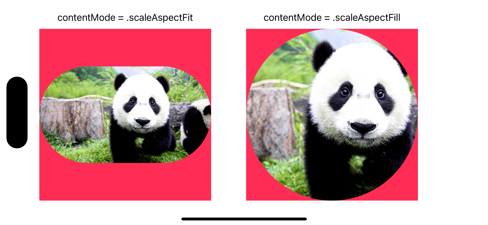

# Swift 中的图片处理

以下处理主要参考了 [Kingfisher](https://github.com/onevcat/Kingfisher) 的相关实现。


## 创建命名空间

利用协议扩展为现有类型添加前缀，避免自定义扩展污染类型的全局命名空间。

```swift
// 定义一个泛型结构体 YUWrapper，它将作为一个通用包装器，能够包装任何类型。
struct YUWrapper<Base> {
    let base: Base // 保存被包装的原始值
    init(_ base: Base) {
        self.base = base // 初始化时将原始值保存到属性中
    }
}

// 定义一个空的协议 YUCompatible，用于标记类类型（引用类型）的对象可以使用 YUWrapper 进行扩展。
protocol YUCompatible: AnyObject { }

// 定义一个空的协议 YUCompatibleValue，用于标记值类型的对象可以使用 YUWrapper 进行扩展。
protocol YUCompatibleValue { }

// 为 YUCompatible 协议扩展一个计算属性 yu，这使得任何遵循 YUCompatible 的类型（即类）都能通过 .yu 访问其包装器 YUWrapper 实例。
extension YUCompatible {
    var yu: YUWrapper<Self> {
        YUWrapper(self)
    }
    
    // 提供一个静态属性 yu，允许通过类型本身访问 YUWrapper，而不是类型的实例。
    static var yu: YUWrapper<Self>.Type {
        YUWrapper<Self>.self
    }
}

// 为 YUCompatibleValue 协议扩展一个计算属性 yu，这使得任何遵循 YUCompatibleValue 的类型（即值类型）也能通过 .yu 访问其包装器 YUWrapper 实例。
extension YUCompatibleValue {
    var yu: YUWrapper<Self> {
        YUWrapper(self)
    }
}

// 让 UIImage 类遵循 YUCompatible 协议，这意味着 UIImage 及其实例现在可以访问 .yu 属性，从而使用 YUWrapper 中定义的功能。
extension UIImage: YUCompatible { }

// 让 UIImageView 类遵循 YUCompatible 协议。
extension UIImageView: YUCompatible { }

// 让 CGSize 和 CGRect 这两个结构体遵循 YUCompatibleValue 协议。
extension CGSize: YUCompatibleValue { }
extension CGRect: YUCompatibleValue { }
```


## 圆角

首先定义两个枚举，分别用于配置圆角大小和图像内容模式。

```swift
enum Radius {
    case widthFraction(CGFloat)
    case heightFraction(CGFloat)
    case point(CGFloat)

    func compute(with size: CGSize) -> CGFloat {
        // 根据枚举值计算实际的圆角大小
        switch self {
        case .point(let point):
            // 直接指定圆角大小
            return point
        case .widthFraction(let widthFraction):
            // 根据容器宽度的百分比计算圆角
            return size.width * widthFraction
        case .heightFraction(let heightFraction):
            // 根据容器高度的百分比计算圆角
            return size.height * heightFraction
        }
    }
}

enum ContentMode: String {
    case none // 不进行调整
    case aspectFit // 保持纵横比缩放内容以适应容器大小，内容完整显示
    case aspectFill // 保持纵横比缩放内容填满容器，可能会裁剪内容
}
```

圆角处理：

```swift
extension YUWrapper where Base == CGSize {
    var aspectRatio: CGFloat {
        base.height == 0.0 ? 1.0 : base.width / base.height
    }
}


extension YUWrapper where Base == UIImage {
    /// 创建一个具有指定圆角的新图像。
    /// - Parameters:
    ///   - radius: 圆角大小，可以是具体的点数、容器宽度的百分比或容器高度的百分比。
    ///   - corners: 指定需要应用圆角的角。默认值是 .allCorners。
    ///   - backgroundColor: 图像背景颜色。如果提供，该颜色将填充图像的背景。
    /// - Returns: 处理后的新图像。
    func roundedImage(
        withRadius radius: Radius,
        roundingCorners corners: UIRectCorner = .allCorners,
        backgroundColor: UIColor? = nil
    ) -> UIImage {
        roundedImage(
            withRadius: radius, containerViewSize: base.size, containerViewContentMode: .none,
            roundingCorners: corners, backgroundColor: backgroundColor
        )
    }
    
    /// 根据容器的尺寸和内容模式创建一个新的具有指定圆角的图像。
    /// - Parameters:
    ///   - radius: 圆角大小，可以是具体的点数、容器宽度的百分比或容器高度的百分比。
    ///   - size: 容器的尺寸，如 imageView 的 size。
    ///   - contentMode: 决定图像如何适应容器的内容模式。
    ///   - corners: 指定需要应用圆角的角。默认值是 .allCorners。
    ///   - backgroundColor: 图像背景颜色。如果提供，该颜色将填充图像的背景。
    /// - Returns: 处理后的新图像。
    func roundedImage(
        withRadius radius: Radius,
        containerViewSize size: CGSize,
        containerViewContentMode contentMode: ContentMode,
        roundingCorners corners: UIRectCorner = .allCorners,
        backgroundColor: UIColor? = nil
    ) -> UIImage {
        // 确保图像基于 CGImage
        guard base.cgImage != nil else {
            assertionFailure("Round corner image only works for CG-based image.")
            return base
        }
        
        // 初始化偏移和缩放因子
        var xOffset: CGFloat = 0, yOffset: CGFloat = 0, scalingFactor: CGFloat = 1
        
        // 根据容器尺寸和内容模式调整图像尺寸和位置
        if size.yu.aspectRatio > base.size.yu.aspectRatio {
            if contentMode == .aspectFill {
                yOffset = (base.size.height - base.size.width / size.yu.aspectRatio) / 2
                scalingFactor = base.size.width / size.width
            } else if contentMode == .aspectFit {
                scalingFactor = base.size.height / size.height
            }
        } else {
            if contentMode == .aspectFill {
                xOffset = (base.size.width - base.size.height * size.yu.aspectRatio) / 2
                scalingFactor = base.size.height / size.height
            } else if contentMode == .aspectFit {
                scalingFactor = base.size.width / size.width
            }
        }
        
        // 计算实际的圆角大小
        let actualCornerRadius = radius.compute(with: base.size) * scalingFactor
        let drawSize = CGSize(width: base.size.width - 2 * xOffset, height: base.size.height - 2 * yOffset)
        
        // 绘制圆角图像
        return draw(to: drawSize) { _ in
            guard let context = UIGraphicsGetCurrentContext() else {
                assertionFailure("Failed to create CG context for image.")
                return false
            }
            
            // 如果指定了背景颜色，则先填充背景
            if let backgroundColor = backgroundColor {
                let rectPath = UIBezierPath(rect: CGRect(origin: .zero, size: drawSize))
                backgroundColor.setFill()
                rectPath.fill()
            }
            
            // 创建并应用圆角路径
            let path = pathForRoundCorner(rect: CGRect(origin: .zero, size: drawSize), cornerRadius: actualCornerRadius, corners: corners)
            context.addPath(path.cgPath)
            context.clip()
            base.draw(in: CGRect(x: -xOffset, y: -yOffset, width: base.size.width, height: base.size.height))
            
            return false
        }
    }

}

private extension YUWrapper where Base == UIImage {
    func pathForRoundCorner(rect: CGRect, cornerRadius: CGFloat, corners: UIRectCorner, offsetBase: CGFloat = 0) -> UIBezierPath {
        UIBezierPath(
            roundedRect: rect,
            byRoundingCorners: corners,
            cornerRadii: CGSize(
                width: cornerRadius - offsetBase / 2,
                height: cornerRadius - offsetBase / 2
            )
        )
    }
    
    // 使用Core Graphics进行自定义绘图，返回一个新的UIImage。
    // - size: 绘图的目标尺寸。
    // - inverting: 是否翻转绘图上下文。当绘制CGImage时，由于坐标系统的差异，有时需要翻转。
    // - scale: 绘制的比例因子。如果不指定，则使用原图像的scale。
    // - refImage: 用作参考的图像，当需要保留原图像的某些属性（如方向）时使用。
    // - draw: 一个闭包，传入CGContext，根据返回值决定是否使用refImage的方向。
    func draw(
        to size: CGSize,
        inverting: Bool = false,
        scale: CGFloat? = nil,
        refImage: UIImage? = nil,
        draw: (CGContext) -> Bool
    ) -> UIImage
    {
        // 创建一个图像渲染器，设置其格式和缩放比例。
        let format = UIGraphicsImageRendererFormat.preferred()
        format.scale = scale ?? base.scale
        let renderer = UIGraphicsImageRenderer(size: size, format: format)
        
        var useRefImage: Bool = false
        // 使用渲染器创建图像。
        let image = renderer.image { rendererContext in
            let context = rendererContext.cgContext
            // 如果需要翻转上下文（例如，绘制CGImage时）。
            if inverting {
                context.scaleBy(x: 1.0, y: -1.0)
                context.translateBy(x: 0, y: -size.height)
            }
            
            // 调用传入的闭包进行自定义绘图，决定是否使用参考图像的方向。
            useRefImage = draw(context)
        }
        // 根据是否使用参考图像，创建并返回最终的UIImage。
        if useRefImage {
            guard let cgImage = image.cgImage else {
                return base // 如果无法获取CGImage，返回原图。
            }
            let ref = refImage ?? base
            // 使用参考图像的方向创建UIImage。
            return UIImage(cgImage: cgImage, scale: format.scale, orientation: ref.imageOrientation)
        } else {
            // 不使用参考图像，直接返回绘制的图像。
            return image
        }
    }
}
```

为方便使用，给 UIImageView 添加一个扩展方法：

```swift
extension YUWrapper where Base == UIImageView {
    func setImage(_ image: UIImage, cornerRadius: Radius, roundingCorners corners: UIRectCorner = .allCorners, backgroundColor: UIColor? = nil) {
        var contentMode: ContentMode = .none
        if base.contentMode == .scaleAspectFit {
            contentMode = .aspectFit
        } else if base.contentMode == .scaleAspectFill {
            contentMode = .aspectFill
        }
        
        base.image = image.yu.roundedImage(
            withRadius: cornerRadius, containerViewSize: base.bounds.size,
            containerViewContentMode: contentMode, roundingCorners: corners, backgroundColor: backgroundColor
        )
    }
}
```

使用：

```swift
override func viewDidLoad() {
    super.viewDidLoad()

    let imageView1 = UIImageView()
    imageView1.backgroundColor = .systemPink
    imageView1.contentMode = .scaleAspectFit
    // ...
    imageViews.append(imageView1)

    let imageView2 = UIImageView()
    imageView2.backgroundColor = .systemPink
    imageView2.contentMode = .scaleAspectFill
    imageView2.clipsToBounds = true
    // ...
    imageViews.append(imageView2)
}

override func viewDidLayoutSubviews() {
    super.viewDidLayoutSubviews()

    imageViews.forEach { imageView in
        // 在 imageView 有确定的 size 之后再调用
        imageView.yu.setImage(.panda, cornerRadius: .heightFraction(0.5))
    }
}
```

效果：




## 后台解码

```swift
extension YUWrapper where Base == UIImage {
    // 扩展UIImage，增加一个计算属性`decoded`用于返回解码后的图像。
    var decoded: UIImage {
        // 确保UIImage基于CGImage，因为解码操作是基于Core Graphics的CGImage进行的。
        guard let imageRef = base.cgImage else {
            assertionFailure("Decoding only works for CG-based image.")
            return base // 如果不是基于CGImage的图像，直接返回原图像。
        }

        // 计算原始图像的尺寸，考虑到了图像的scale。UIImage的scale属性标识了图像的像素密度。
        // 例如，@2x图像的scale为2，这意味着图像的宽度和高度应该除以scale，以获得正确的显示尺寸。
        let size = CGSize(width: CGFloat(imageRef.width) / base.scale, height: CGFloat(imageRef.height) / base.scale)
        // 调用`draw(to:inverting:scale:draw:)`方法进行解码操作。
        return draw(to: size, inverting: true, scale: base.scale) { context in
            // 在给定的上下文中绘制原始CGImage。
            // 这里创建了一个与原图相同尺寸的上下文，并将原图绘制进去，实现了解码。
            context.draw(imageRef, in: CGRect(origin: .zero, size: size))
            return true // 返回true表示使用绘制的图像。
        }
    }
}
```

使用：

```swift
DispatchQueue.global().async {
    let decodedImage: UIImage = .panda.yu.decoded
    DispatchQueue.main.async {
        self.imageView.image = decodedImage
    }
}
```


## 调整尺寸

```swift
import CoreGraphics
import func AVFoundation.AVMakeRect

extension YUWrapper where Base == CGSize {
    // resize 方法接受一个 desiredSize 和 contentMode 参数，返回调整后的 CGSize。
    func resize(to desiredSize: CGSize, for contentMode: ContentMode = .aspectFit) -> CGSize {
        var targetSize: CGSize
        switch contentMode {
        case .none:
            // 如果 contentMode 为 .none，则直接使用 desiredSize 作为目标尺寸。
            targetSize = desiredSize
        case .aspectFit:
            // 如果 contentMode 为 .aspectFit，使用 AVMakeRect 计算适合内部矩形的宽高比。
            // 这保证了尺寸调整后的大小将完全适应指定区域，同时保持原始的宽高比。
            let rect = AVFoundation.AVMakeRect(aspectRatio: base, insideRect: .init(origin: .zero, size: desiredSize))
            targetSize = rect.size
        case .aspectFill:
            // 如果 contentMode 为 .aspectFill，计算缩放因子以填充目标区域，同时保持原始的宽高比。
            // 这可能会导致目标尺寸超出 desiredSize 指定的范围。
            let scalingFactor = max(desiredSize.width / base.width, desiredSize.height / base.height)
            targetSize = CGSize(width: base.width * scalingFactor, height: base.height * scalingFactor)
        }
        
        return targetSize
    }
}

extension YUWrapper where Base == UIImage {
    // resize 方法接受一个 desiredSize 和 contentMode 参数，返回调整后的 UIImage。
    func resize(to desiredSize: CGSize, for contentMode: ContentMode = .none) -> UIImage {
        // 使用 CGSize 扩展的 resize 方法计算目标尺寸。
        let targetSize = base.size.yu.resize(to: desiredSize, for: contentMode)
        return draw(to: targetSize) { _ in
            base.draw(in: CGRect(origin: .zero, size: targetSize))
            return false
        }
    }
}
```

使用：

```swift
imageView.image = .panda.yu.resize(to: CGSize(width: 500, height: 500), for: .aspectFit)
```


## 裁剪

```swift
import CoreGraphics

extension YUWrapper where Base == CGSize {
    // 计算给定尺寸和锚点的约束矩形。
    func constrainedRect(for size: CGSize, anchor: CGPoint) -> CGRect {
        // 确保锚点的x和y值位于[0, 1]的范围内，防止超出范围的值。
        let unifiedAnchor = CGPoint(x: anchor.x.clamped(to: 0.0...1.0),
                                    y: anchor.y.clamped(to: 0.0...1.0))
        
        // 计算裁剪矩形的起始点。基于锚点和目标尺寸与基础尺寸的关系进行计算。
        let x = unifiedAnchor.x * base.width - unifiedAnchor.x * size.width
        let y = unifiedAnchor.y * base.height - unifiedAnchor.y * size.height
        // 创建裁剪矩形。
        let r = CGRect(x: x, y: y, width: size.width, height: size.height)
        
        // 创建一个原点为(0, 0)，尺寸为基础尺寸的CGRect。
        let ori = CGRect(origin: .zero, size: base)
        // 返回两个矩形的交集，即最终的约束矩形。
        return ori.intersection(r)
    }
}

extension YUWrapper where Base == CGRect {
    // 根据给定的缩放比例，返回缩放后的CGRect。
    func scaled(_ scale: CGFloat) -> CGRect {
        CGRect(x: base.origin.x * scale, y: base.origin.y * scale, width: base.size.width * scale, height: base.size.height * scale)
    }
}

// 为所有可比较类型提供一个方法，将值限制在给定范围内。
private extension Comparable {
    // 将当前值限制在闭区间limits内。
    func clamped(to limits: ClosedRange<Self>) -> Self {
        min(max(self, limits.lowerBound), limits.upperBound)
    }
}

extension YUWrapper where Base == UIImage {
    // 定义一个裁剪方法，接受目标尺寸和一个可选的锚点参数，默认锚点在图像中心。
    func crop(to size: CGSize, anchorOn anchor: CGPoint = CGPoint(x: 0.5, y: 0.5)) -> UIImage {
        // 确保UIImage基于CGImage，因为裁剪操作是基于Core Graphics的CGImage进行的。
        guard let cgImage = base.cgImage else {
            assertionFailure("Crop only works for CG-based image.")
            return base // 如果不是基于CGImage的图像，直接返回原图像。
        }
        
        // 计算裁剪矩形。这一步涉及到根据指定的锚点和目标尺寸，计算出一个CGRect作为裁剪区域。
        let rect = base.size.yu.constrainedRect(for: size, anchor: anchor)
        
        // 使用Core Graphics的cropping方法进行裁剪。
        guard let image = cgImage.cropping(to: rect.yu.scaled(base.scale)) else {
            assertionFailure("Cropping image failed.")
            return base // 如果裁剪失败，返回原图像。
        }
        
        // 使用裁剪后的CGImage创建一个新的UIImage对象，保持原图像的scale和orientation不变。
        return UIImage(cgImage: image, scale: base.scale, orientation: base.imageOrientation)
    }
}
```

使用：

```swift
imageView.image = .panda.yu.crop(to: CGSize(width: 1600, height: 800), anchorOn: .zero)
```


## 下采样

```swift
extension YUWrapper where Base == UIImage {
    static func downsample(data: Data, to pointSize: CGSize) -> UIImage? {
        // 设置图像源选项，指定不应在创建时缓存图像数据。
        let imageSourceOptions = [kCGImageSourceShouldCache: false] as CFDictionary
        
        // 获取屏幕的缩放比例。
        let scale = if #available(iOS 13, *) { UITraitCollection.current.displayScale } else { UIScreen.main.scale }
        
        // 计算目标尺寸的最大维度（以像素为单位），乘以屏幕的缩放比例。
        let maxDimensionInPixels = max(pointSize.width, pointSize.height) * scale
        
        // 设置降采样选项。
        let downsampleOptions = [
            kCGImageSourceCreateThumbnailFromImageAlways: true,         // 生成缩略图
            kCGImageSourceShouldCacheImmediately: true,                 // 是否在创建图片时就进行解码
            kCGImageSourceCreateThumbnailWithTransform: true,           // 根据完整图像的方向和像素纵横比旋转和缩放缩略图
            kCGImageSourceThumbnailMaxPixelSize: maxDimensionInPixels   // 指定缩略图的最大维度
        ] as CFDictionary
        
        // 尝试创建图像源，使用提供的图像数据和图像源选项。
        guard
            let imageSource = CGImageSourceCreateWithData(data as CFData, imageSourceOptions),
            // 尝试创建降采样图像，指定索引为0（通常图像数据只包含一个图像）和下采样选项。
            let downsampledImage = CGImageSourceCreateThumbnailAtIndex(imageSource, 0, downsampleOptions)
        else { return nil } // 如果创建失败，返回nil。
        
        // 使用下采样后的CGImage创建并返回UIImage对象。
        return UIImage(cgImage: downsampledImage)
    }

    static func downsample(imageAt imageURL: URL, to pointSize: CGSize) -> UIImage? {
        let imageSourceOptions = [kCGImageSourceShouldCache: false] as CFDictionary
        let scale = if #available(iOS 13, *) { UITraitCollection.current.displayScale } else { UIScreen.main.scale }
        let maxDimensionInPixels = max(pointSize.width, pointSize.height) * scale
        let downsampleOptions = [
            kCGImageSourceCreateThumbnailFromImageAlways: true,
            kCGImageSourceShouldCacheImmediately: true,
            kCGImageSourceCreateThumbnailWithTransform: true,
            kCGImageSourceThumbnailMaxPixelSize: maxDimensionInPixels
        ] as CFDictionary
        
        guard
            let imageSource = CGImageSourceCreateWithURL(imageURL as CFURL, imageSourceOptions),
            let downsampledImage = CGImageSourceCreateThumbnailAtIndex(imageSource, 0, downsampleOptions)
        else { return nil }
        
        return UIImage(cgImage: downsampledImage)
    }
}
```

使用：

```swift
let image: UIImage = .panda
imageView.image = UIImage.yu.downsample(data: image.pngData()!, to: imageView.bounds.size)
```
>>>>>>> a90ef4b (Initial commit)
